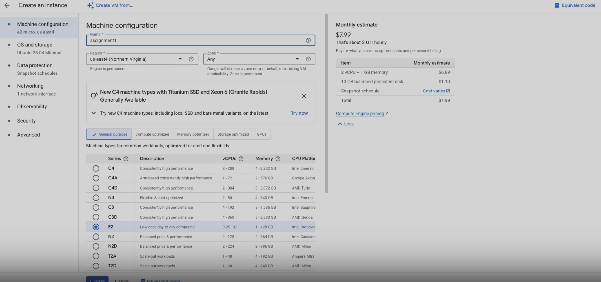
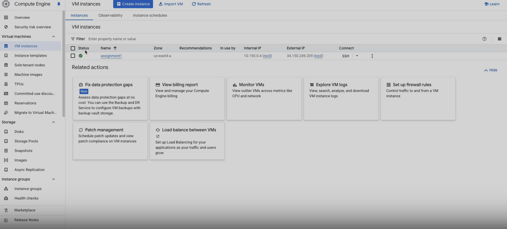
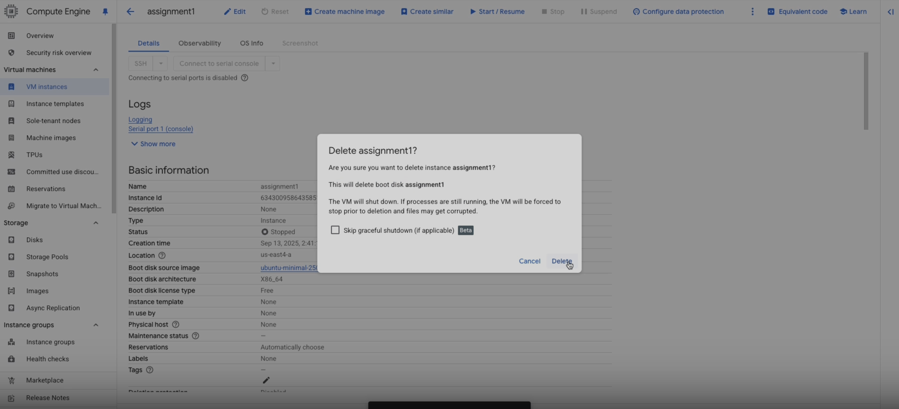
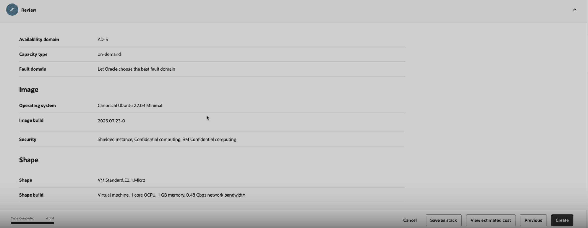
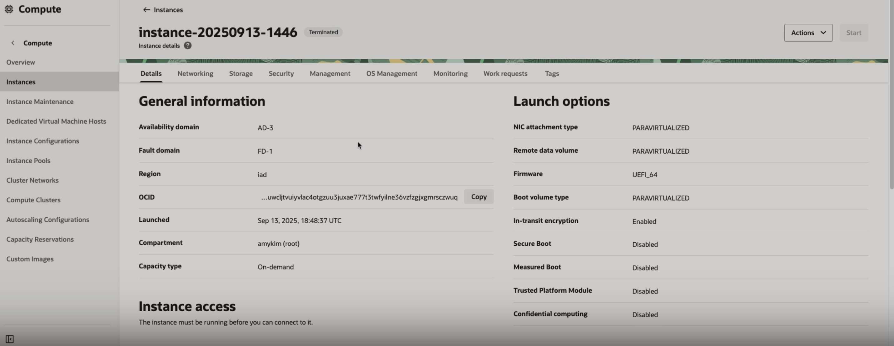

# gcp_oci_vm_start
AHI 504 — Cloud Foundations for Health Informatics - Assignment 1

[Loom tutorial link](https://www.loom.com/share/bf92ae8e04c5410a94a1945da34e82d9?sid=d01e3ad0-9fd8-4a16-9f3f-6d5b2bf761b6)

## Google Cloud Platform (GCP)
1. Go to console.google.com
2. Click on Create new VM
3. Create instance
4. Give this machine a name - remember to not have any white spaces. Only use hyphens and underscore. No special characters
5. For Region, click drop down and choose location that is closest to you (these locations represent data centers that Google owns)
6. Select a compute - depends on what you're trying to accomplish for your task. For this example, it will be E2
7. Then, scroll down to Machine type, and for preset, open the dropdown menu and select GCP: e2-micro. This is the smallest machine option
8. On left side, click OS and storage -> click change and change to Ubuntu version (this is the most common linux environment and has a lot of preinstalled software embedded in it) 
    - operating system -> ubuntu
    - everything else the same = leave as default
9. On left panel, click on data protection
    - we will leave everything as default
10. On left panel, click on networking
    - we will leave everything as default

11. At the bottom, click create. After it is created, click on the VM
12. scroll through the details of VM that you created

13. Back on main screen "VM Instances" click on the three dots on far right side of your new VM
14. Click stop. And then click Delete

## Oracle Cloud Infrastructure (OCI)
1. Go to https://cloud.oracle.com/
2. Select "Create a VM instance" under the Build section of the Home page
3. Select the options that you want for the VM
    - Image - Ubuntu. Place into Lab compartment
    - Shape - VM.Standard.E2.1.Micro 
    - Boot volume - default minimal size
    - Networking - attach to your VCN/subnet; assign public IP if required
4. Create VM after all selections made and wait to see that it is running and active

5. Stop the VM and verify
6. Terminate the VM with "delete the boot volume" checked
7. Confirm termination and no instances, boot volumes, or public IPs remain

## Reflections
### Similarities
- Each provides descriptions of what different tabs do and the functions available within them
- Both provide dashboards with tabs that describe functions
- Both offer cloud storage, networking, and compute services
- Both require billing setup with free-tier options available
- Both have global data centers for scalability and availability.

### Differences
- On GCP, once a VM is deleted, there is no visible history of it. In contrast, Oracle displays past terminated VM
- GCP has a cleaner, beginner-friendly layout; OCI is more technical and complex
- GCP is often faster and smoother for general use; OCI can feel slower but offers deep customization
- GCP’s tab descriptions are more detailed and user-friendly; OCI assumes more technical knowledge

### Preference (OCI vs GCP) and Why
- Between the two, my personal preference is GCP. I find it faster, easier to navigate, and designed in a way that feels clear and simple for new users. The clearly marked tabs and straightforward layout make it less intimidating for beginners. That said, I can also recognize the strengths of Oracle Cloud Infrastructure. Its ability to show history of terminated VMs and its more technical structure may make it better suited for advanced users who need more detailed control.